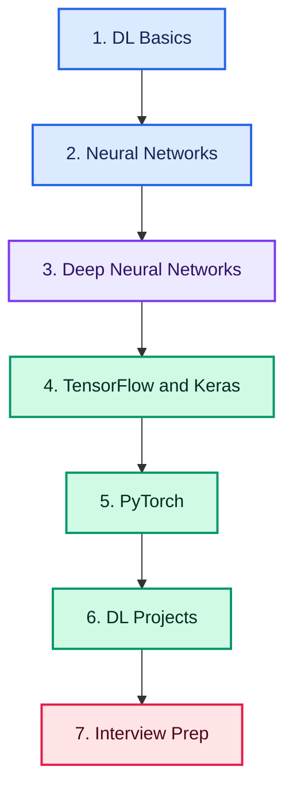

# Deep Learning Roadmap: From Beginner to Production-Ready DL Engineer

> A complete, project-based learning path covering Deep Learning fundamentals, neural networks, optimization, TensorFlow, PyTorch, model training, and real-world projects

## Quick Roadmap

**Foundations:** [DL Basics](#dl-basic) • [Neural Networks](#neural-networks) • [Deep Neural Networks](#deep-neural-networks)

**Frameworks:** [TensorFlow & Keras](#tensorflow--keras) • [PyTorch](#pytorch)

**Build & Apply:** [DL Project](#dl-project) • [Portfolio Projects](#portfolio-projects)

**Career Path:** [20-Week Learning Plan](#20-week-balanced-learning-plan) • [Interview Preparation](INTERVIEWS.md) • [Contributing Guide](CONTRIBUTING.md)

## Why Learn Deep Learning?

Deep Learning powers modern computer vision, speech, and generative systems. Learning it helps you understand how neural networks actually learn, build models that scale, and prepare for AI/ML engineering roles that require more than just calling APIs.

## Build Job-Ready Deep Learning Skills

Go beyond theory and learn how to:

- Understand how neural networks learn through forward and backward propagation
- Choose the right loss functions, optimizers, and activation functions
- Train stable deep networks using normalization, regularization, and initialization
- Build and train models in both TensorFlow/Keras and PyTorch
- Debug vanishing/exploding gradients and overfitting
- Deploy trained models and export them for production
- Build portfolio projects and prepare for interviews

> **Learn the concepts. Build real projects. Become production-ready.**

Follow the roadmap in order, starting with DL fundamentals before moving into neural network internals, training stability, frameworks, and projects.

## Complete Learning Path

### DL Basic

- [Roadmap](https://tech.examadda.org/deep-learning/roadmap)
- [History of DL](https://tech.examadda.org/deep-learning/history-of-deep-learning)
- [AI vs ML vs DL vs GenAI](https://tech.examadda.org/deep-learning/ai-vs-machine-learning-vs-deep-learning-vs-generative-ai-main-category)

- Types of Learning

  - [Supervised Learning](https://tech.examadda.org/deep-learning/supervised-learning-1)
  - [Unsupervised Learning](https://tech.examadda.org/deep-learning/unsupervised-learning-1)
  - [Semi-Supervised Learning](https://tech.examadda.org/deep-learning/semi-supervised-learning)
  - [Self-Supervised Learning](https://tech.examadda.org/deep-learning/self-supervised-learning)
  - [Reinforcement Learning](https://tech.examadda.org/deep-learning/reinforcement-learning-1)

- [Deep Learning Workflow](https://tech.examadda.org/deep-learning/deep-learning-workflow)
- [Applications of Deep Learning](https://tech.examadda.org/deep-learning/applications-of-deep-learning)
- [CPU vs GPU vs TPU](https://tech.examadda.org/deep-learning/cpu-vs-gpu-vs-tpu)

- Popular Frameworks

  - [TensorFlow](https://tech.examadda.org/deep-learning/tensorflow)
  - [PyTorch](https://tech.examadda.org/deep-learning/pytorch)
  - [Tensor Basics](https://tech.examadda.org/deep-learning/tensor-basics)
  - [Computational Graph](https://tech.examadda.org/deep-learning/computational-graph)

---

### Neural Networks

- [Biological Neuron](https://tech.examadda.org/deep-learning/biological-neuron)
- [Perceptron](https://tech.examadda.org/deep-learning/perceptron)
- [Multi Layer Perceptron (MLP)](https://tech.examadda.org/deep-learning/multi-layer-perceptron-mlp)
- [Feed Forward Neural Network](https://tech.examadda.org/deep-learning/feed-forward-neural-network)
- [Hidden Layers](https://tech.examadda.org/deep-learning/hidden-layers-in-neural-networks)
- [Forward Propagation](https://tech.examadda.org/deep-learning/forward-propagation-in-neural-networks)
- [Backpropagation](https://tech.examadda.org/deep-learning/backpropagation-in-neural-networks)
- [Computational Graph](https://tech.examadda.org/deep-learning/computational-graph-in-deep-learning)

- Loss Functions

  - [MSE](https://tech.examadda.org/deep-learning/mean-squared-error-mse-in-deep-learning)
  - [MAE](https://tech.examadda.org/deep-learning/mean-absolute-error-mae-in-deep-learning)
  - [BCE](https://tech.examadda.org/deep-learning/binary-cross-entropy-bce-in-deep-learning)
  - [CCE](https://tech.examadda.org/deep-learning/categorical-cross-entropy-loss-function)
  - [Huber](https://tech.examadda.org/deep-learning/huber-loss-function)

- Activation Functions

  - [Linear](https://tech.examadda.org/deep-learning/linear-activation-function)
  - [Sigmoid](https://tech.examadda.org/deep-learning/sigmoid-activation-function)
  - [Tanh](https://tech.examadda.org/deep-learning/tanh-activation-function)
  - [ReLU](https://tech.examadda.org/deep-learning/relu-activation-function)
  - [Leaky ReLU](https://tech.examadda.org/deep-learning/leaky-relu-activation-function)
  - [ELU](https://tech.examadda.org/deep-learning/elu-activation-function)
  - [GELU](https://tech.examadda.org/deep-learning/softmax-activation-function)
  - [Softmax](https://tech.examadda.org/deep-learning/softmax-activation-function-1)

- Gradient Descent

  - [Batch Gradient Descent](https://tech.examadda.org/deep-learning/batch-gradient-descent)
  - [Stochastic Gradient Descent (SGD)](https://tech.examadda.org/deep-learning/stochastic-gradient-descent)
  - [Mini Batch Gradient Descent](https://tech.examadda.org/deep-learning/mini-batch-gradient-descent)

  - Optimizers

    - [SGD](https://tech.examadda.org/deep-learning/sgd-optimizer-in-deep-learning-working-algorithm-and-applications)
    - [Momentum](https://tech.examadda.org/deep-learning/momentum-optimizer)
    - [Nesterov](https://tech.examadda.org/deep-learning/nesterov-accelerated-gradient)
    - [AdaGrad](https://tech.examadda.org/deep-learning/adagrad-optimizer)
    - [AdaDelta](https://tech.examadda.org/deep-learning/adadelta-optimizer)
    - [RMSProp](https://tech.examadda.org/deep-learning/rmsprop-optimizer)
    - [Adam](https://tech.examadda.org/deep-learning/adam-optimizer)
    - [AdamW](https://tech.examadda.org/deep-learning/adamw-optimizer)
    - [Nadam](https://tech.examadda.org/deep-learning/nadam-optimizer)
    - [Lion](https://tech.examadda.org/deep-learning/lion-optimizer)

- [Learning Rate](https://tech.examadda.org/deep-learning/learning-rate-deep-learning)
- [Learning Rate Scheduler](https://tech.examadda.org/deep-learning/learning-rate-scheduler)
- [Warmup](https://tech.examadda.org/deep-learning/warmup-deep-learning)
- [Cosine Annealing](https://tech.examadda.org/deep-learning/cosine-annealing-deep-learning)
- [Gradient Clipping](https://tech.examadda.org/deep-learning/gradient-clipping-deep-learning)
- [Early Stopping](https://tech.examadda.org/deep-learning/early-stopping-in-deep-learning-working-benefits-and-applications)

---

### Deep Neural Networks

- [Universal Approximation Theorem](https://tech.examadda.org/deep-learning/universal-approximation-theorem)
- [Vanishing Gradient](https://tech.examadda.org/deep-learning/vanishing-gradient)
- [Exploding Gradient](https://tech.examadda.org/deep-learning/exploding-gradient)

- Weight Initialization

  - [Xavier Initialization](https://tech.examadda.org/deep-learning/xavier-initialization)
  - [He Initialization](https://tech.examadda.org/deep-learning/he-initialization)

- [Regularization in DL](https://tech.examadda.org/deep-learning/regularization-in-deep-learning)
- [Introduction to TensorFlow](https://tech.examadda.org/deep-learning/introduction-to-tensorflow)
- [Introduction to PyTorch](https://tech.examadda.org/deep-learning/introduction-to-pytorch)
- [Building First Neural Network](https://tech.examadda.org/deep-learning/building-first-neural-network-pytorch)
- [Training Custom Models](https://tech.examadda.org/deep-learning/training-custom-models-pytorch)
- [Batch Normalization](https://tech.examadda.org/deep-learning/batch-normalization)
- [Layer Normalization](https://tech.examadda.org/deep-learning/layer-normalization-1)
- [Dropout](https://tech.examadda.org/deep-learning/dropout-deep-learning)

- Regularization

  - [L1 Regularization](https://tech.examadda.org/deep-learning/l1-regularization)
  - [L2 Regularization](https://tech.examadda.org/deep-learning/l2-regularization)
  - [Weight Decay](https://tech.examadda.org/deep-learning/weight-decay)

- [Residual Connections](https://tech.examadda.org/deep-learning/residual-connections-1)
- [Skip Connections](https://tech.examadda.org/deep-learning/skip-connections)
- [Mixed Precision Training](https://tech.examadda.org/deep-learning/mixed-precision-training)
- [Checkpointing](https://tech.examadda.org/deep-learning/checkpointing)
- [Transfer Learning](https://tech.examadda.org/deep-learning/transfer-learning)
- [Fine-Tuning](https://tech.examadda.org/deep-learning/fine-tuning)

---

### TensorFlow & Keras

- [Installation](https://tech.examadda.org/deep-learning/tensorflow-keras-installation)
- [Tensors](https://tech.examadda.org/deep-learning/tensors-in-deep-learning)
- [Tensor Operations](https://tech.examadda.org/deep-learning/tensor-operations)
- [Keras](https://tech.examadda.org/deep-learning/keras-in-deep-learning)
- [Sequential API](https://tech.examadda.org/deep-learning/sequential-api-in-keras)
- [Functional API](https://tech.examadda.org/deep-learning/functional-api-in-keras)
- [Model Subclassing](https://tech.examadda.org/deep-learning/model-subclassing-in-keras)
- [Custom Layers](https://tech.examadda.org/deep-learning/custom-layers-in-keras)
- [Custom Loss](https://tech.examadda.org/deep-learning/custom-loss-functions-in-keras)
- [Custom Metrics](https://tech.examadda.org/deep-learning/custom-metrics-in-keras)
- [Custom Training Loop](https://tech.examadda.org/deep-learning/custom-training-loop-in-keras)
- [TensorBoard](https://tech.examadda.org/deep-learning/tensorboard-in-keras)
- [Save/Load Models](https://tech.examadda.org/deep-learning/save-load-models-in-keras)
- [Model Deployment Basics](https://tech.examadda.org/deep-learning/model-deployment-basics-in-keras)

---

### PyTorch

- [Installation](https://tech.examadda.org/deep-learning/pytorch-installation)
- [Tensors](https://tech.examadda.org/deep-learning/tensors-in-pytorch)
- [Autograd](https://tech.examadda.org/deep-learning/autograd-in-pytorch)
- [Dataset](https://tech.examadda.org/deep-learning/datasets-in-pytorch)
- [DataLoader](https://tech.examadda.org/deep-learning/dataloader-in-pytorch)
- [nn.Module](https://tech.examadda.org/deep-learning/nn-module-in-pytorch)
- [Optimizers](https://tech.examadda.org/deep-learning/optimizers-in-pytorch)
- [Training Loop](https://tech.examadda.org/deep-learning/training-loop-in-pytorch)
- [Validation](https://tech.examadda.org/deep-learning/validation-in-pytorch)
- [Callbacks](https://tech.examadda.org/deep-learning/callbacks-in-pytorch)
- [TorchScript](https://tech.examadda.org/deep-learning/torchscript-in-pytorch)
- [ONNX Export](https://tech.examadda.org/deep-learning/onnx-export-in-pytorch)
- [Save/Load Models](https://tech.examadda.org/deep-learning/save-load-models-in-pytorch)

---

### DL Project

- [Basic Project — Handwritten Digit Recognition using CNN](https://tech.examadda.org/deep-learning/handwritten-digit-recognition-using-cnn-mnist)

---

## Portfolio Projects

Build practical projects that demonstrate real-world Deep Learning skills.

| Level | Project | Core Skills | Deliverables |
|:---:|---|---|---|
| 🟢 Beginner | Handwritten Digit Recognition (CNN, MNIST) | CNNs, TensorFlow/PyTorch basics, training loops | Notebook, README, accuracy report |
| 🟢 Beginner | Image Classifier (Custom Dataset) | Data loading, augmentation, transfer learning | Web demo, model card |
| 🟡 Intermediate | Regularized Deep Classifier | Dropout, batch norm, L1/L2, early stopping | Training report, comparison plots |
| 🟡 Intermediate | Custom Training Loop Framework | Autograd, custom loss/metrics, checkpointing | Reusable training library |
| 🟠 Advanced | Transfer Learning Pipeline | Pretrained backbones, fine-tuning, mixed precision | Deployed inference API |
| 🟠 Advanced | Model Export & Serving | ONNX/TorchScript export, benchmarking, deployment | Served model, latency report |

## Interview Preparation

Prepare for Deep Learning interviews with level-based questions and practical scenarios.

| Level | Resource |
|:---:|---|
| 🟢 Beginner | [Beginner DL Interview Questions](https://tech.examadda.org/deep-learning/beginner-interview-questions) |
| 🟡 Intermediate | [Intermediate DL Interview Questions](https://tech.examadda.org/deep-learning/intermediate-interview-questions) |
| 🔴 Advanced | [Advanced DL Interview Questions](https://tech.examadda.org/deep-learning/advanced-interview-questions) |
| 🟣 Scenario-Based | [Scenario-Based DL Interview Questions](https://tech.examadda.org/deep-learning/scenario-based-interview-questions) |

For structured preparation, follow the complete [DL Interview Preparation Guide](INTERVIEWS.md).

Focus on backpropagation mechanics, optimizer trade-offs, regularization choices, vanishing/exploding gradients, initialization strategy, framework fluency (TensorFlow vs PyTorch), and deployment/export basics.

## 20-Week Balanced Learning Plan

| Weeks | Learning Focus | Milestone |
|:---:|---|---|
| 1–2 | DL basics, workflow, and hardware fundamentals (CPU/GPU/TPU) | Framework setup + first tensor ops |
| 3–5 | Neural network internals: forward/backward prop, loss functions, activations | MLP built from scratch |
| 6–8 | Gradient descent variants, optimizers, learning-rate scheduling | Optimizer comparison experiment |
| 9–11 | Training stability: initialization, normalization, regularization | Regularized deep classifier |
| 12–14 | TensorFlow & Keras: APIs, custom layers/losses, training loops | Keras-based image classifier |
| 15–17 | PyTorch: autograd, Dataset/DataLoader, training & validation loops | PyTorch training pipeline |
| 18–19 | Transfer learning, mixed precision, export (ONNX/TorchScript), deployment | Deployed inference demo |
| 20 | Capstone and interview revision | Live demo, README, and case study |

> Complete each milestone as a documented GitHub project to build an interview-ready portfolio.

## Contributing

Corrections, explanations, test cases and implementations are welcome. Read [CONTRIBUTING.md](CONTRIBUTING.md) before opening a pull request.

## About ExamAdda

[ExamAdda](https://examadda.org) is an all-in-one platform for mastering DSA, system design, development skills, and coding interviews through structured courses, hands-on practice, company-wise questions, and mock interviews.

**Learn smarter. Practice consistently. Crack top tech interviews.**

[Start Learning](https://tech.examadda.org/) • [Explore Courses](https://tech.examadda.org/courses/) • [Unlock ExamAdda Premium](https://examadda.org/premium)

## License

This repository is available under the [MIT License](LICENSE).
